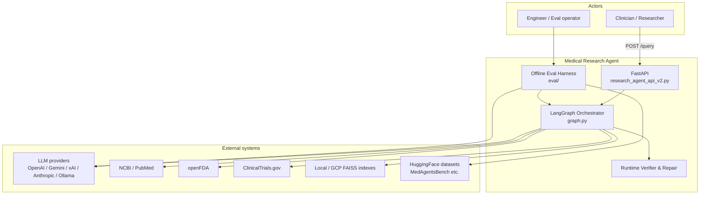
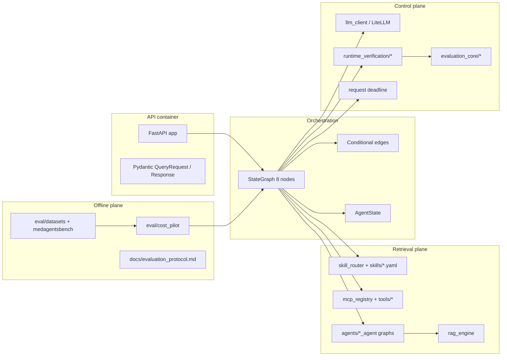
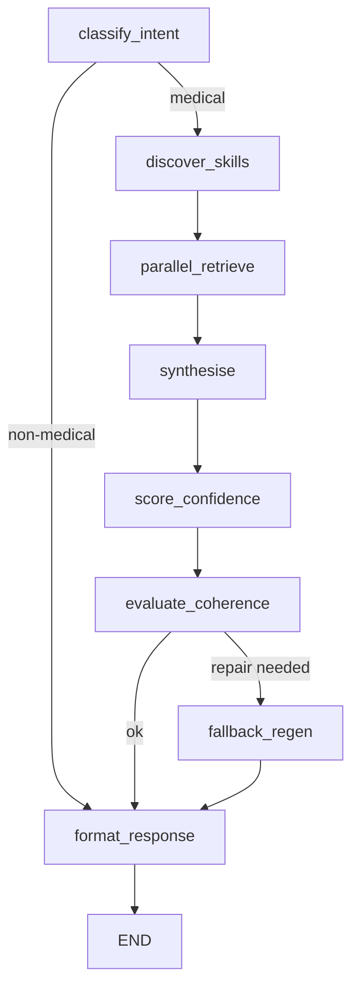
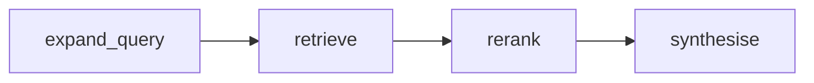
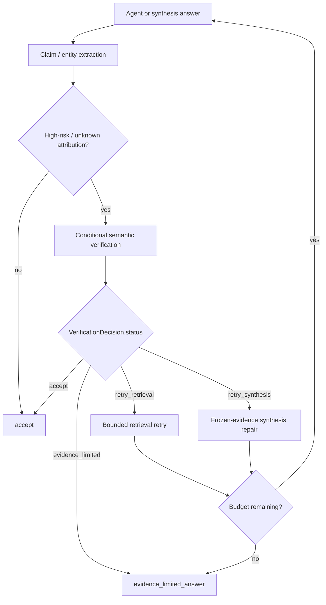
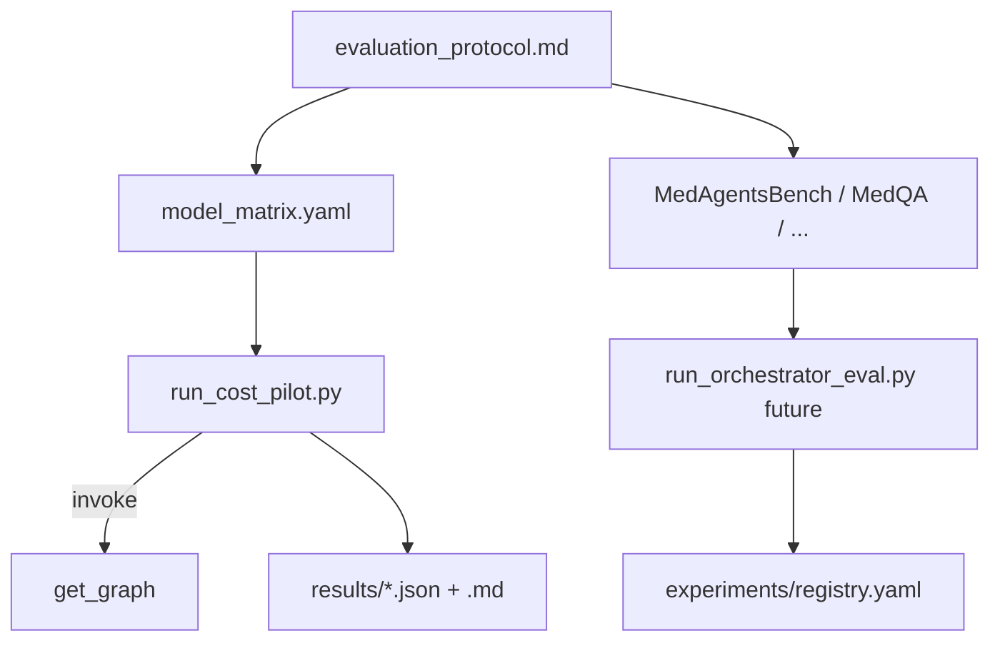
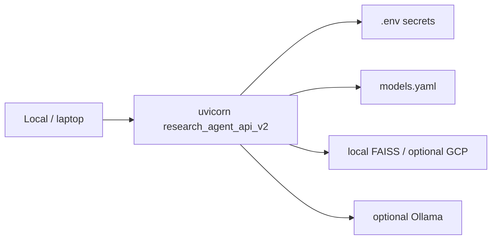

# High-Level Design (HLD)

**System:** Medical Research Agent  
**Scope:** Production query path + offline evaluation boundary  
**Related:** [LLD.md](./LLD.md) · [ADR.md](./ADR.md) · [evaluation_protocol.md](../evaluation_protocol.md)

---

## 1. Mission and non-goals

### Mission

Provide a clinician-facing, LLM-agnostic research agent that:

1. Retrieves grounded evidence from biomedical sources (PubMed, FDA, ClinicalTrials.gov, local indexes; extensible).
2. Synthesises citation-rich answers with quantified confidence / runtime quality signals.
3. Applies **bounded, qrel-free runtime verification and repair** during live requests.
4. Supports reproducible offline benchmarking (MedAgentsBench hard set, MedQA, etc.) without leaking gold labels into production.

### Non-goals (current freeze)

- Clinical decision support claims or patient-specific precision medicine.
- Persona / user-profile customisation (removed from target API).
- CI/CD delivery pipelines (explicitly cancelled unless re-requested).
- Full LangSmith/Prometheus production observability (Phase 5 deferred).
- Unbounded multi-agent debate loops or unconstrained tool calling.

---

## 2. System context (C4 Level 1)

**Trust boundary:** The API never receives gold benchmark answers. Offline eval invokes the orchestrator as a black box (or sub-agent graphs for legacy pilots) and scores outputs post-hoc.

---

## 3. Container view (C4 Level 2)

---

## 4. Logical architecture

### 4.1 Production request path

| Node | Responsibility |
|------|----------------|
| `classify_intent` | Medical-domain gate; early reject |
| `discover_skills` | YAML skill manifests + semantic/keyword selection |
| `parallel_retrieve` | Fan-out to MCP tools / sub-agent graphs; per-agent verify/retry/repair |
| `synthesise` | Cross-agent evidence synthesis via `LLMClient` |
| `score_confidence` | Coverage + runtime quality components |
| `evaluate_coherence` | Verifier decision → fallback gate (legacy coherence if decision invalid) |
| `fallback_regen` | At most one bounded top-level regeneration |
| `format_response` | AMA-style citations, disclaimers, terminal answer binding |

### 4.2 Domain sub-agent pattern

Each mapped source uses a 4-node LangGraph subgraph:

Mapped tools (`nodes/parallel_retrieve.py`):

| MCP tool | Sub-agent graph |
|----------|-----------------|
| `search_pubmed` | `PubMedAgentGraph` |
| `search_fda` | `FDAAgentGraph` |
| `search_clinical_trials` | `ClinicalTrialsAgentGraph` |
| `search_local_index` | `LocalAgentGraph` |
| `search_pubmed_deep` | MCP/remote fallback (telemetry blind spot deferred) |

Shared retrieval backbone: `rag_engine` + MedCPT cross-encoder reranker singleton.

### 4.3 Runtime verifier-and-repair (online)

Properties:

- **Qrel-free:** no gold labels.
- **Budgets:** separate caps for retrieval retries vs synthesis repairs (request `context`).
- **Telemetry:** `AttemptEvent` → aggregated into `EvaluationTrace` v1.0.0.
- **Terminal policy:** exhausted repair budget → evidence-limited answer (not unrepaired free text).

### 4.4 Offline evaluation plane

Primary hard benchmark row: **MedAgentsBench `test_hard` N=862** (separate from standalone MedQA).

---

## 5. Data flow (end-to-end)

1. Client `POST /query` with `question`, `model_id`, optional `agents_to_use`, budgets, `include_evaluation_trace`.
2. API builds `AgentState`, sets `_runtime_deadline_at_monotonic`, invokes compiled graph.
3. Classification may short-circuit to formatted rejection.
4. Skill discovery selects tools (or uses explicit override).
5. Parallel retrieve runs selected agents under a bounded executor + per-tool timeout.
6. Per-agent verification may retry retrieval or repair synthesis within budgets.
7. Top-level synthesis aggregates evidence; scoring and coherence/verification gate decide fallback.
8. Format binds terminal answer, citations, confidence, `trace_id`, opt-in redacted traces.
9. Offline pilots later re-invoke the same graph and score from traces + labels.

---

## 6. Cross-cutting concerns

| Concern | Approach |
|---------|----------|
| **LLM agnosticism** | All generation/judge calls via `LLMClient` → LiteLLM; IDs in `models.yaml` |
| **Cost / tokens** | Per-attempt telemetry; cost pilot matrix planning at 55k/4k mid scenario |
| **Deadlines** | Monotonic deadline in context; LLM kwargs + retrieval timeouts (pre-retrieval gaps deferred) |
| **Privacy** | Fingerprints in cost artifacts; redacted API traces; broader PHI/LangSmith policy deferred |
| **Concurrency** | `asyncio` + process-bounded executor; agent invoke locks for ephemeral indexes |
| **Extensibility** | New source = skill YAML + MCP tool / sub-agent graph; orchestrator unchanged |
| **Reproducibility** | `trace_id`, model revision fields, protocol version, git commit in eval artifacts |

---

## 7. Deployment view (current)

- Single-process FastAPI + in-process tools (not microservice-per-tool).
- No required container/CI in current freeze.
- Laptop models (Ollama/vLLM) supported for zero-API ablations.

---

## 8. Quality attributes

| Attribute | Target design |
|-----------|---------------|
| **Groundedness** | Retrieval-first synthesis; claim verification; evidence-limited degradation |
| **Safety of claims** | Conservative routing when verifier invalid; no gold leakage |
| **Observability** | Structured traces/telemetry; LangSmith deferred |
| **Swapability** | Model matrix + LiteLLM; skill manifests |
| **Scientific validity** | Separate offline protocol; MedAgentsBench hard set; no clinical-efficacy claims |
| **Cost control** | Bounded retries; cost pilot before full N=862 matrices |

---

## 9. Deferred / known gaps (not HLD blockers)

- Pre-retrieval deadline coverage (`classify_intent`, `discover_skills`, embeddings).
- `pubmed_deep` remote telemetry blind spot.
- Non-cancellable rerank/fetch after timeout.
- Broad fetcher/graph logging privacy + LangSmith PHI export policy.
- Full `run_orchestrator_eval.py` official harness (next implementation slice).

---

## 10. Document map to code

| HLD concept | Primary code |
|-------------|--------------|
| API | `research_agent_api_v2.py` |
| Graph | `graph.py`, `edges.py`, `nodes/*` |
| State | `agent_state.py` |
| Skills | `skill_router.py`, `skills/*.yaml` |
| Tools / agents | `tools/*`, `mcp_registry.py`, `agents/*` |
| RAG | `rag_engine/*` |
| LLM | `llm_client.py`, `models.yaml` |
| Runtime verify | `runtime_verification/*` |
| Trace schemas | `evaluation_core/*` |
| Offline eval | `eval/*`, `docs/evaluation_protocol.md` |
