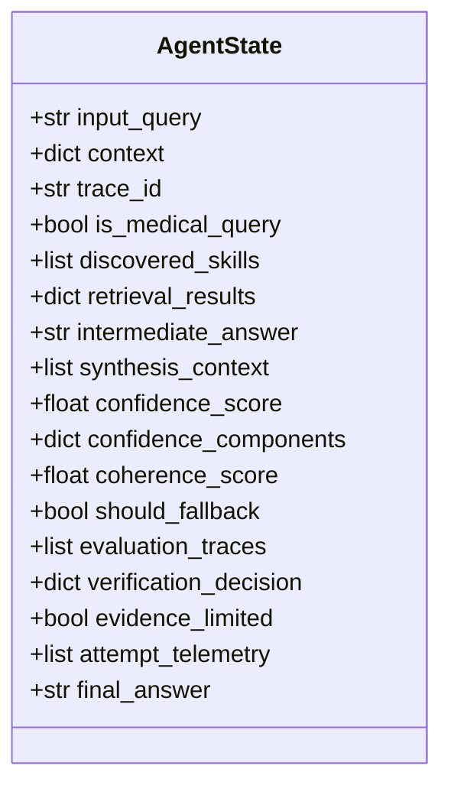
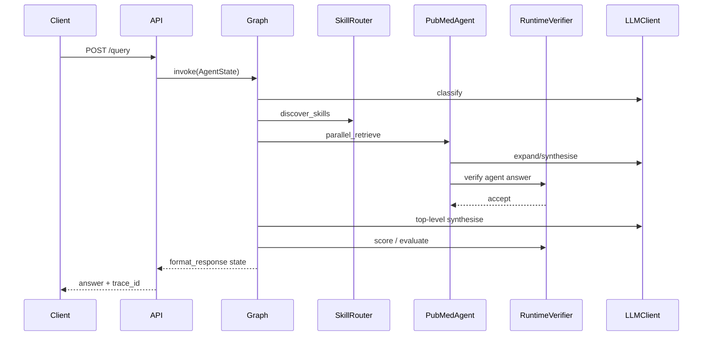
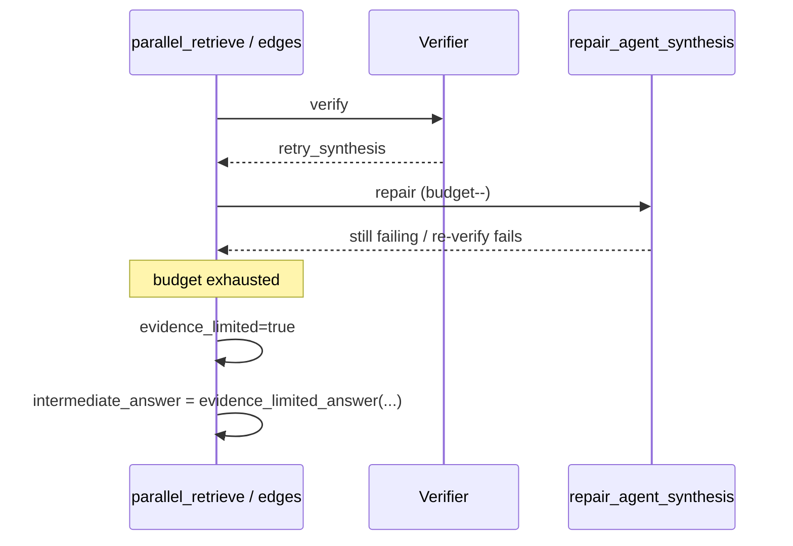

# Low-Level Design (LLD)

**System:** Medical Research Agent  
**Companion:** [HLD.md](./HLD.md) · [ADR.md](./ADR.md)

This document specifies module contracts, state fields, algorithms, and interfaces as implemented on the Phase 1 + Step 2A/B freeze.

---

## 1. Repository layout (logical packages)

```
medical-research-agent/
├── research_agent_api_v2.py     # FastAPI entry
├── graph.py / edges.py         # Top-level StateGraph
├── agent_state.py              # AgentState TypedDict
├── nodes/                      # 8 orchestrator nodes
├── agents/                     # Domain sub-agent graphs
│   ├── base.py                 # SubAgentGraph 4-node pattern
│   ├── pubmed_agent/
│   ├── fda_agent/
│   ├── clinical_trials_agent/
│   └── local_agent/
├── tools/                      # MCP-facing tool wrappers
├── rag_engine/                 # Chunk / embed / hybrid retrieve
├── runtime_verification/       # Online verifier & repair
├── evaluation_core/            # Shared schemas, privacy, deadlines
├── skill_router.py + skills/   # Skill discovery manifests
├── llm_client.py + models.yaml # LiteLLM abstraction
├── eval/                       # Offline harness (separate plane)
│   ├── cost_pilot.py / run_cost_pilot.py
│   ├── configs/model_matrix.yaml
│   ├── medagentsbench.py
│   └── datasets.py
└── docs/
    ├── evaluation_protocol.md
    └── architecture/           # This folder
```

---

## 2. API contract

### 2.1 Endpoint

`POST /query` — `research_agent_api_v2.py`

### 2.2 Request (selected fields)

| Field | Type | Role |
|-------|------|------|
| `question` | str | User query |
| `model_id` | str | Generation model (LiteLLM id) |
| `top_k` / source-specific top_k | int | Retrieval depth |
| `agents_to_use` | list[str]? | Override skill discovery |
| `max_agent_retries` | int 0–1 | Per-agent retrieval retry budget |
| `max_agent_synthesis_repairs` | int | Per-agent frozen-evidence repair budget |
| `max_synthesis_repairs` | int | Top-level fallback/repair budget |
| `include_evaluation_trace` | bool | Opt-in redacted traces in response |

### 2.3 Response (selected fields)

| Field | Role |
|-------|------|
| `answer` | Terminal formatted answer |
| `citations` | AMA-style citations |
| `confidence` / quality fields | Coverage + runtime quality |
| `trace_id` | Correlation id |
| `fallback_triggered` / `evidence_limited` | Control-plane outcomes |
| `execution_time_*` / token & cost aggregates | Telemetry |
| Redacted `evaluation_traces` | Only if opted in |

Privacy: `evaluation_core.privacy` redacts sensitive values and fingerprints queries in offline artifacts.

---

## 3. AgentState contract

Defined in `agent_state.py`. All nodes read/write this TypedDict.

### 3.1 Lifecycle groups



### 3.2 Critical fields for verification

| Field | Producer | Consumer |
|-------|----------|----------|
| `evaluation_traces` | parallel_retrieve / synthesis path | API opt-in, cost pilot |
| `verification_decision` | verifier / evaluate_coherence | `edges.after_evaluate_coherence` |
| `repair_history` | repair/retry paths | telemetry, debugging |
| `evidence_limited` | edges / retrieve / format | terminal answer policy |
| `synthesis_context` | retrieve/synthesis | frozen-evidence repair |
| `context._runtime_deadline_at_monotonic` | API | LLM + retrieve timeouts |

### 3.3 Context knobs (budgets)

Defaults enforced at API and/or node level:

- `max_agent_retries` ∈ {0,1}
- `max_agent_synthesis_repairs`
- `max_synthesis_repairs` (top-level fallback count capped at 1 in edge logic)

---

## 4. Graph compilation (LLD)

`graph.py::build_graph()`:

1. `StateGraph(AgentState)`
2. Register 8 nodes
3. Entry: `classify_intent`
4. Conditional: `after_classify_intent` → `discover_skills` | `format_response`
5. Linear: discover → retrieve → synthesise → score → evaluate
6. Conditional: `after_evaluate_coherence` → `fallback_regen` | `format_response`
7. fallback → format → `END`
8. `compile()`; lazy singleton via `get_graph()`

### 4.1 Edge algorithms

**`after_classify_intent`**

```
if not is_medical_query → format_response
else → discover_skills
```

**`after_evaluate_coherence`**

```
if verification_decision is valid and status ∈ recognized:
    should_repair = (status == "retry_synthesis")
else:
    should_repair = should_fallback OR coherence < 0.6   # legacy

if should_repair AND fallback_count < max_fallbacks:
    if repair budget exhausted → set evidence_limited, replace intermediate_answer
    else → fallback_regen
else → format_response
```

Recognized statuses: `accept`, `retry_retrieval`, `retry_synthesis`, `evidence_limited`.

---

## 5. Skill discovery LLD

**Inputs:** query text, optional `agents_to_use`  
**Config:** `skills/*.yaml` (name, description, triggers, domains, cost/latency hints)  
**Engine:** `skill_router.py` — embedding similarity + keyword triggers (hybrid modes)  
**Output state:** `discovered_skills`, `skill_scores`

Override rule: non-empty `agents_to_use` bypasses discovery ranking.

---

## 6. Parallel retrieve LLD

**File:** `nodes/parallel_retrieve.py` (largest control-plane node)

### 6.1 Tool resolution

```
for skill in discovered_skills:
  if skill in _AGENT_GRAPH_MAP:
      invoke SubAgentGraph (expand→retrieve→rerank→synthesise)
  else:
      invoke mcp_registry tool wrapper
```

### 6.2 Concurrency

- `asyncio` gather over tools
- Blocking work submitted to `runtime_verification.executor.BoundedExecutor`
- Per-call `asyncio.wait_for` timeout; saturation and timeout counters in `runtime_executor_metrics`

### 6.3 Per-agent verify / retry / repair loop (simplified)

```
trace = build_agent_evaluation_trace(...)
decision = RuntimeVerifier.verify(trace, ...)

while decision needs action and budgets remain and deadline ok:
  if status == retry_retrieval:
      rebuild retry request (expanded queries / filters from feedback)
      re-invoke agent retrieve path
  elif status == retry_synthesis:
      repair_agent_synthesis(frozen synthesis_context, feedback)
      on failure: _record_failed_agent_repair(trace)
  re-verify

if budgets exhausted or evidence_limited:
  mark evidence_limited; emit limited answer payload
aggregate AttemptEvents → token_usage / cost / attempt_telemetry
```

### 6.4 Token aggregation

Use `_normalized_token_total()` — do **not** naively `sum(token_usage.values())` (avoids double-counting `total`).

### 6.5 Sub-agent graph LLD

`agents/base.py::SubAgentGraph`:

| Node | Behavior |
|------|----------|
| `expand_query` | LLM query expansion from domain prompts |
| `retrieve` | `rag_engine` / domain fetcher |
| `rerank` | MedCPT CrossEncoder singleton |
| `synthesise` | Domain synthesis prompt → `LLMClient` |

Thread safety: `serialized_invoke` lock around ephemeral index mutation.  
Deadline: `llm_deadline_kwargs(state)` raises `RuntimeDeadlineExceeded` when remaining ≤ 0.

---

## 7. Runtime verification module LLD

| Module | Responsibility |
|--------|----------------|
| `verifier.py` | `RuntimeVerifier`, `VerifierConfig`, decision construction |
| `claim_verifier.py` | Conditional high-risk semantic verification |
| `entities.py` | Unknown attribution candidates (title-case, alphanumeric codes, alias exclusions) |
| `evidence.py` | Evidence context builders; `evidence_limited_answer` |
| `repair.py` | Frozen-evidence synthesis repair |
| `retry_policy.py` | Structured retry request from feedback |
| `confidence.py` | Weighted runtime quality components |
| `telemetry.py` | `AttemptEvent`, LLM call metadata recording, aggregation |
| `deadline.py` | Deadline helpers |
| `executor.py` | Bounded thread pool + saturation |
| `factory.py` | `build_runtime_verifier()` |

### 7.1 VerificationDecision schema

```
status: accept | retry_retrieval | retry_synthesis | evidence_limited
component_scores: dict[str, float]
failed_checks: list[str]
structured_feedback: list[dict]
target_stage / target_agent
recommended_retry_changes: dict
verifier_confidence: float
valid: bool
error?: str
verifier_model / prompt_version / raw_decision
```

### 7.2 EvaluationTrace schema (v1.0.0)

Sidecar per attempt (`evaluation_core/schemas.py`):

- Query + expanded queries
- Retrieved / reranked docs + final context spans (hashes)
- Answer, atomic claims, citation resolutions
- Stage latency, token_usage, cost_breakdown_usd
- Model + prompt + config versions
- `verification_decisions`, `retry_feedback`, `repair_history`, `attempt_events`
- `partial_response`, errors

Validated by `validate_evaluation_trace()`. Frozen as **v1** for offline pilots.

---

## 8. Synthesis, scoring, fallback, format

| Node | LLD notes |
|------|-----------|
| `synthesise` | Builds prompt from aggregated retrieval / agent outputs + `synthesis_context`; records tokens/cost |
| `score_confidence` | Coverage = successful tools / selected tools; fills `confidence_components` + `runtime_quality_score` |
| `evaluate_coherence` | Prefer runtime verification decision; populate `should_fallback` / explanations |
| `fallback_regen` | Single conservative regen with evidence when available |
| `format_response` | Bind terminal answer from intermediate vs fallback; AMA citations; disclaimers; evidence-limited messaging |

---

## 9. LLM client LLD

`llm_client.py`:

- Loads `models.yaml` router config
- Exposes chat/completion with usage + cost metadata
- Used by classifier, agents, synthesis, verifier, fallback
- Local Ollama / vLLM via LiteLLM `api_base`

Cost fields: `cost_per_1k_input_tokens` / `cost_per_1k_output_tokens` (must stay synced with `eval/configs/model_matrix.yaml` before paid runs).

---

## 10. Offline evaluation LLD

### 10.1 Separation rules

| Concern | Runtime | Offline |
|---------|---------|---------|
| Gold labels | Forbidden | Required for accuracy |
| Mutates answer | Yes (bounded) | No |
| Primary hard set | N/A | MedAgentsBench `test_hard` N=862 |
| Artifact | EvaluationTrace | Pilot JSON + registry |

### 10.2 Cost pilot

`eval/cost_pilot.py` + `eval/run_cost_pilot.py`:

1. Invoke full orchestrator (or dry-run mock telemetry)
2. Aggregate per-question tokens/cost/latency/repairs
3. Project to N ∈ {100, 500, 862}
4. Attach **`matrix_planning`**: mid-token 55k/4k × model_matrix prices for MedAgentsBench

```
recommended_purchase = projected_cost × 1.25 + 5.00
```

### 10.3 MedAgentsBench adapter

`eval/medagentsbench.py` + `MedAgentsBenchDataset` in `datasets.py`:

- Provenance constants (paper, HF id, N=862)
- `normalize_row`, `stratified_sample_by_source`
- Lazy local cache: `eval/data/medagentsbench_test_hard.json`
- `MedAgentsBenchNotDownloadedError` if missing (no silent download)
- AfriMedQA (+32) optional → loaded_n may be 894; **official N remains 862**

Registry key: `medagentsbench_test_hard` — never merged into `medqa`.

---

## 11. Sequence diagrams

### 11.1 Happy path medical query



### 11.2 Repair-budget exhaustion



---

## 12. Error and degradation taxonomy

| Condition | Behavior |
|-----------|----------|
| Non-medical query | Early format rejection |
| Tool timeout | Error in `retrieval_results`; coverage drops |
| Executor saturated | `ExecutorSaturatedError` / metrics; degrade |
| Deadline exceeded | `RuntimeDeadlineExceeded`; stop further LLM where wired |
| Verifier unavailable / invalid | Legacy coherence threshold path |
| Repair failure | Telemetry error event; may evidence-limit |
| Missing MedAgentsBench cache | Clear offline exception (eval only) |

---

## 13. Configuration surface

| File | Contents |
|------|----------|
| `.env` | API keys, Ollama URL, LangSmith (optional) |
| `models.yaml` | LiteLLM model registry + $/1k |
| `skills/*.yaml` | Tool manifests |
| `eval/configs/model_matrix.yaml` | Eval candidates, prices, splits, pilot matrix |
| `prompts/<domain>/` | Agent prompt templates |

---

## 14. Test map (architecture-facing)

| Suite | Guards |
|-------|--------|
| `test_runtime_*.py` | Verifier, repair, graph integration |
| `test_evaluation_trace.py` | Schema v1 |
| `test_api_trace_opt_in.py` | Redaction / opt-in |
| `eval/test_cost_pilot.py` | Pilot math + matrix N=862 |
| `eval/test_medagentsbench.py` | Adapter stub / stratification |

---

## 15. Extension recipes

### Add a retrieval source

1. `skills/<name>.yaml`
2. `tools/<name>_tool.py` implementing MCP contract **or** `agents/<name>_agent/graph.py`
3. Register in MCP registry / `_AGENT_GRAPH_MAP`
4. No change to top-level 8-node topology required

### Add a benchmark

1. Protocol row in `evaluation_protocol.md`
2. Loader in `eval/datasets.py` with distinct registry key
3. Split size in `DEFAULT_FULL_SPLIT_SIZES` + `model_matrix.benchmark_full_splits`
4. Never feed labels into `AgentState` production path
