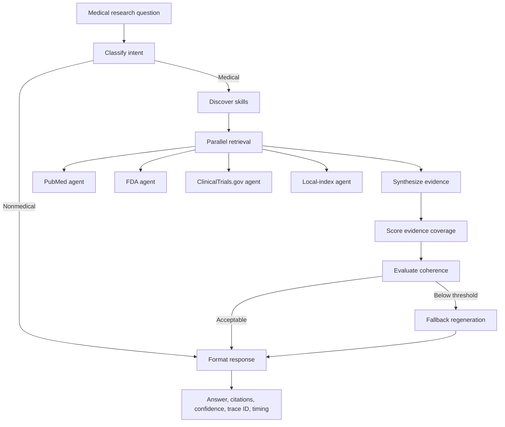

# Precision Evidence Orchestration for Medical Research: Design and Preliminary Technical Evaluation of an LLM-Agnostic Multi-Agent Retrieval System

**Manuscript type:** Original Research — Methods and Preliminary Technical Evaluation  
**Running title:** Precision Evidence Orchestration for Medical Research  
**Authors:** Omitted for blinded review  
**Corresponding author:** Omitted for blinded review  
**Word count:** 4,167 (main text, excluding references)  

## Abstract

### Background

Large language models can synthesize biomedical information, but unsupported claims, stale knowledge, opaque provenance, and dependence on a single model provider limit their suitability for medical research workflows. Retrieval-augmented generation (RAG) can ground answers in external evidence, yet medical RAG systems remain difficult to evaluate and can fail when retrieval is noisy or the selected source does not match the question.

### Objective

To design and technically validate a modular medical research agent that applies **precision evidence orchestration**: query-dependent selection of specialized evidence sources, retrieval strategies, and language models while preserving traceability, confidence estimates, and explicit failure states.

### Methods

We developed an eight-node LangGraph state machine that classifies medical intent, discovers relevant skills, retrieves evidence concurrently from four specialized sub-agents (PubMed, openFDA, ClinicalTrials.gov, and a local institutional index), synthesizes an answer, estimates evidence coverage, evaluates coherence, conditionally regenerates low-coherence answers, and formats cited output. Domain agents use hybrid sparse–dense retrieval, reciprocal-rank fusion, MedCPT reranking, and evidence-constrained synthesis. We separately evaluated source selection on a 20-question held-out routing set and direct domain-agent answer generation on a 20-question, agent-stratified benchmark. Outcomes included top-k routing accuracy, generation quality, retrieval-context relevance and sufficiency, citation-bearing claim support, citation coverage, latency, and execution failures. Valid denominators and percentile-bootstrap 95% confidence intervals were calculated over question-level scores.

### Results

On the held-out routing set, top-1 accuracy was 0.85, top-3 accuracy was 1.00, and mean reciprocal rank was 0.908. All 20 answer-generation evaluations completed without execution errors, and all metric outputs were valid. After separating context-grounding judgments from reference-answer judgments, mean faithfulness was 0.905 (95% CI, 0.790–0.990), answer relevancy 0.290 (0.160–0.450), answer correctness 0.218 (0.080–0.375), citation fidelity 0.738 (0.538–0.900), and hallucination rate 0.090 (0.005–0.210). Stage-specific post-hoc analysis found context relevance of 0.387 (0.215–0.572), context sufficiency of 0.334 (0.158–0.532), citation-bearing claim support of 0.324 (0.147–0.525), and sentence citation coverage of 0.337 (0.193–0.482). Mean end-to-end latency was 137.9 seconds.

### Conclusions

The routing and domain-agent components were technically executable across four heterogeneous evidence environments, and the intended source was present within the top three routes for every question in this small held-out test. However, low correctness and relevancy, incomplete retrieval coverage, long local-model latency, and wide confidence intervals preclude claims of end-to-end or clinical effectiveness. The system should be considered a reproducible research prototype requiring full-graph and clinician-adjudicated evaluation.

### Keywords

precision medicine; precision AI; retrieval-augmented generation; large language models; multi-agent systems; biomedical information retrieval; clinical decision support; evidence synthesis; medical informatics

## Introduction

Precision medicine seeks to replace a one-size-fits-all approach with prevention and treatment strategies informed by variability in genes, environment, and lifestyle.[1,2] The same principle can be applied to information access: a medical question about drug labeling, an actively recruiting trial, a peer-reviewed treatment effect, and a local protocol should not be answered from the same undifferentiated corpus. We use the term **precision evidence orchestration** to describe computational selection of the evidence source, retrieval pathway, and synthesis behavior that best match a question's clinical domain and information need. This is a precision-AI method for evidence access; it is not, by itself, individualized treatment recommendation or a substitute for patient-level clinical judgment.

General-purpose large language models (LLMs) have shown substantial biomedical question-answering capability, but model parameters do not provide a stable or auditable knowledge base. Generated answers can contain plausible unsupported statements, omit recent evidence, or cite nonexistent sources. RAG addresses part of this problem by exposing a model to retrieved evidence at inference time. RAGAS formalized automated component-level evaluation of faithfulness, answer relevance, and context relevance,[3] while a recent systematic review found heterogeneous methods, limited standardized evaluation, and insufficient attention to ethics across health-care RAG studies.[4] Retrieval is not intrinsically protective: irrelevant or incomplete passages can propagate into fluent but misleading answers, making stage-aware evaluation essential.

Existing biomedical benchmarks address complementary tasks. MedQA contains licensing-examination questions from the United States, mainland China, and Taiwan,[5] whereas BioASQ evaluates large-scale biomedical semantic indexing and natural-language question answering.[6,7] These benchmarks are valuable for model-level comparison but do not directly test whether a modular system routes a regulatory question to FDA data, a trial-status question to ClinicalTrials.gov, or an institution-specific question to a private index. Evaluation of an orchestrated system therefore requires both established benchmark support and source-stratified technical validation.

Clinical AI guidance emphasizes transparent intended use, error analysis, human oversight, and explicit limitations. WHO guidance identifies autonomy, safety, transparency, accountability, inclusiveness, and sustainability as core principles for AI in health.[8] CONSORT-AI and SPIRIT-AI extend trial-reporting standards for AI interventions,[9,10] while DECIDE-AI targets early live clinical evaluation and human factors.[11] The present work is an in-silico technical validation, not a clinical trial or live clinical evaluation. We nevertheless report the system's intended use, model and data flow, failure handling, evaluation denominators, and safety boundaries in preparation for subsequent expert and prospective studies.

The study objectives were to: (1) implement a provider-agnostic, graph-based medical research agent; (2) route questions to specialized PubMed, FDA, clinical-trial, and local-index agents; (3) produce source-linked answers with quantified confidence and observable execution; and (4) conduct a reproducible, agent-stratified pilot evaluation that distinguishes generation quality from execution and judge failures.

## Methods

### Study design

This was a software methods and in-silico technical-validation study. No patients were enrolled, no clinical decisions were made, and no protected health information was processed. Development and evaluation were performed on the repository version and environment recorded in the accompanying reproducibility artifacts.

### Intended use and safety boundary

The system is intended to assist clinicians and medical researchers with evidence discovery and synthesis. It is not intended to diagnose, prescribe, autonomously select treatment, or replace review of primary sources. Every formatted answer includes a clinical-use disclaimer. Outputs should be treated as research summaries whose citations and source records require verification.

### Precision evidence orchestration

We operationalized precision AI at the evidence-workflow level through four mechanisms:

1. **Intent precision:** reject or short-circuit nonmedical requests.
2. **Source precision:** map questions to specialized PubMed, FDA, ClinicalTrials.gov, or local-index skills.
3. **Retrieval precision:** use domain prompts, sparse and dense retrieval, and cross-encoder reranking rather than a single global similarity search.
4. **Model precision:** route all generation and embedding calls through configurable model registries so quality, cost, latency, privacy, and local-deployment constraints can be varied without changing orchestration logic.

This definition does not imply genomic or phenotypic personalization. Patient-specific precision medicine would additionally require validated patient-data interfaces, privacy controls, subgroup-aware evidence matching, clinical calibration, and prospective evaluation.

### System architecture

The production pipeline is a typed LangGraph state machine with eight nodes:

The shared state records query text, context, trace identifier, classification, selected skills and scores, per-tool retrieval results and timing, intermediate synthesis, coverage confidence, coherence, fallback status, final answer, citations, total execution time, cost estimate, and recoverable errors. Conditional graph edges provide an early exit for nonmedical queries and a single-pass fallback for low-coherence synthesis.

### LLM abstraction

All chat and embedding requests pass through one `LLMClient` abstraction. Cloud-provider calls are delegated to LiteLLM, whereas the reported local Ollama configuration uses native Ollama chat and embedding endpoints through the same client interface. Model identifiers, provider credentials, token-cost metadata, context windows, and embedding dimensions are configured outside agent logic.

### Skill discovery and source routing

Each retriever is described by a YAML skill manifest containing its name, tool mapping, trigger terms, high-specificity source-intent cues, clinical domains, estimated cost, and expected latency. The router combines keyword, domain, and optional embedding similarity with a bounded boost for explicit cues such as *FDA label*, *recruiting trial*, or *institutional protocol*. Explicit agent selection can override automatic discovery for controlled experiments. Tool inputs and outputs follow JSON-schema-validated MCP-style contracts, allowing retrieval errors to be captured without terminating the full graph.

### Domain sub-agents

Each domain agent exposes a common `invoke(query, context)` interface and returns answer text, citations, confidence, retrieved sources, model identifier, domain, timing, and error state.

**PubMed.** The PubMed agent expands the query, builds NCBI E-utilities requests, retrieves paper metadata and abstracts, chunks the acquired text, constructs ephemeral sparse and dense indexes, performs hybrid retrieval and reciprocal-rank fusion, reranks candidates with `ncbi/MedCPT-Cross-Encoder`, and synthesizes an AMA-style cited answer.

**FDA.** The FDA agent extracts regulatory search concepts, queries openFDA endpoints, converts returned records into retrievable chunks, applies the shared hybrid retrieval and reranking stack, and synthesizes a labeling- or safety-focused response.

**ClinicalTrials.gov.** The clinical-trials agent extracts trial search terms, queries ClinicalTrials.gov API v2, structures and chunks study records, prioritizes trial-specific context, reranks evidence, and generates an answer describing statuses and relevant study attributes.

**Local index.** The local agent accepts institutional or user-supplied documents, builds an in-process hybrid index, reranks results, and answers only from the supplied local evidence. This pathway is designed for policies, protocols, and curated corpora that should not be sent to public search services.

### Retrieval and synthesis

Documents are chunked before indexing. Sparse retrieval uses BM25 and dense retrieval uses an HNSW index over configurable embeddings. Candidate rankings are fused by reciprocal-rank fusion and reranked with a biomedical cross-encoder. If embedding construction or dense query encoding fails, the retriever records the degradation and continues with BM25 rather than discarding already acquired source records. Synthesis prompts enumerate evidence passages and instruct the LLM to ground claims in those passages. Citation strings are assembled from source metadata. Cloud completions and native Ollama chat or batch-embedding calls use bounded retry for recognized transient failures; authentication and configuration errors fail immediately.

### Confidence, coherence, and fallback

The top-level confidence score represents successful evidence-source coverage rather than calibrated probability of clinical correctness. A separate coherence evaluator assesses whether the synthesized response is internally coherent and responsive. Scores below the configured threshold trigger one conservative regeneration pass. These scores must not be interpreted as patient-level risk estimates or probabilities that the answer is correct.

### Observability and reproducibility

Each request receives a trace identifier. The observability layer supports structured JSON logs, LangSmith traces when configured, and Prometheus metrics for graph nodes, tools, latency, token use, and errors. The experiment registry records run identifier, timestamp, dataset, models, agents, sample count, and aggregate results. A fixed random seed controls benchmark subsampling and bootstrap intervals.

### Evaluation dataset

We constructed `medical_benchmark.json`, a 20-question source-stratified pilot set with five questions assigned to each agent:

- PubMed: treatment evidence, guideline-oriented pharmacotherapy, anticoagulation, immune-related toxicity, and primary prevention.
- FDA: approved indications, boxed warnings, labeled adverse events, emergency-use indication, and contraindications.
- ClinicalTrials.gov: obesity, multiple myeloma, Alzheimer disease, influenza vaccines, and chronic kidney disease.
- Local index: five questions paired with short synthetic institutional documents covering hypertension, diabetes diagnosis, prosthetic-joint prophylaxis, renal dosing, and infection-control policy.

Questions were designed to test source selection and evidence synthesis rather than diagnostic performance. Reference answers were author-written summaries. Public-source agents retrieved live records, so the corpus is time-dependent; local-agent documents are versioned with the benchmark.

Routing was evaluated separately on `routing_holdout.json`, which contains 20 additional questions (five per source) that were not used to set router weights or source-intent cues. We report top-1 accuracy, top-3 accuracy, and mean reciprocal rank. This held-out set evaluates source identification only; it does not evaluate answer quality.

### Experimental configuration

The evaluation harness executes each answer-generation question only against its designated agent, records the exact model and timing, and stores question-level outputs. To eliminate cloud-quota missingness, the definitive experiment was fully local: generation used Qwen2.5-Coder-7B-Instruct (Q4_K_M) through `ollama/qwen2.5-coder:7b`, automatic judging used the distinct Qwen2.5-3B-Instruct (Q4_K_M) endpoint `ollama/qwen2.5:3b`, dense retrieval and routing used `ollama/nomic-embed-text`, and reranking used `ncbi/MedCPT-Cross-Encoder`. Temperature was 0 for judging and domain-configured for query expansion and synthesis. Bounded retries were enabled for transient provider failures. The seed was 42. The evaluated Ollama endpoints did not expose calibrated token log-probabilities, so none were imputed or interpreted as correctness confidence. Retriever-native fusion and reranker scores were not pooled because their scales are not calibrated across agents.

### Outcomes

Primary technical outcomes were:

1. **Faithfulness (higher is better):** degree to which answer claims are supported by retrieved context, scored by an LLM judge from 0 to 1.
2. **Answer relevancy (higher is better):** directness and completeness relative to the question, scored from 0 to 1.
3. **Answer correctness (higher is better):** factual agreement and clinically important coverage relative to the author-written reference answer, scored from 0 to 1 without requiring verbatim wording.
4. **Citation fidelity (higher is better):** proportion of in-text citation markers that reference available retrieved sources. Answers with no citation markers receive 0 rather than a neutral perfect score.
5. **Hallucination rate (lower is better):** fraction of atomic claims judged unsupported by retrieved evidence.

Secondary retrieval-stage outcomes were context relevance (proportion of retrieved passages materially relevant to the question), context sufficiency (coverage of clinically important reference-answer facts by the retrieved set), support for citation-bearing claims by any retrieved passage, and a deterministic sentence citation-coverage heuristic. These were computed post hoc from preserved artifacts in one additional structured judge call per question. Citation-bearing claim support is a retrieved-set measure, not strict entailment by the individually numbered source. Other secondary outcomes were end-to-end latency, execution-error count, and number of valid judge outputs. Every metric required a numeric score in `[0,1]`; invalid outputs were excluded from metric denominators.

To prevent reference-answer leakage into grounding outcomes, faithfulness and hallucination rate were judged together using only the question, retrieved context, and candidate answer. Answer relevancy and correctness were judged in a separate call using the question, reference answer, and candidate answer. A malformed response invalidated only its two-metric group, rather than all four LLM-judged outcomes.

### Statistical analysis

Question-level metrics were summarized by agent and overall. We report arithmetic means with deterministic percentile-bootstrap 95% confidence intervals (2,000 resamples; seed 42), valid denominators for every metric, execution-error counts, and mean, median, and 95th-percentile latency. Given five questions per agent, intervals are descriptive and hypothesis testing was not performed. The benchmark was not powered for between-agent superiority claims because agent questions and source types differ.

### Ethics

The evaluation used public biomedical APIs and synthetic institutional passages. It involved no human participants, patient records, intervention, or identifiable private information; institutional-review-board review was therefore not sought. Future patient-facing or clinician-in-the-loop evaluation will require local ethics and governance review.

## Results

### Evaluation completion and data quality

The definitive run evaluated 20 questions: five each for PubMed, openFDA, ClinicalTrials.gov, and the local index. All 20 agent invocations completed, no execution errors were recorded, and each of the five metrics had 20/20 valid observations. Thus, the reported means were not conditioned on selective judge completion. The run used only locally served generation, judging, and embedding models; public records were acquired live from their respective APIs.

### Held-out source routing

On 20 held-out source-intent questions, the intended source ranked first for 17/20 questions (top-1 accuracy, 0.85), appeared within the first three routes for all 20 (top-3 accuracy, 1.00), and produced a mean reciprocal rank of 0.908. These estimates apply to source-explicit questions and should not be extrapolated to ambiguous questions that legitimately require multiple sources.

### Overall technical performance

Across all agents, mean faithfulness was 0.905 (95% CI, 0.790–0.990), answer relevancy was 0.290 (0.160–0.450), answer correctness was 0.218 (0.080–0.375), citation fidelity was 0.738 (0.538–0.900), and hallucination rate was 0.090 (0.005–0.210). The intervals are descriptive bootstrap intervals over 20 heterogeneous questions rather than inferential comparisons against a baseline.

### Retrieval-stage grounding

The agents returned a mean of 3.55 contexts per question. Mean context relevance was 0.387 (95% CI, 0.215–0.572), context sufficiency was 0.334 (0.158–0.532), citation-bearing claim support was 0.324 (0.147–0.525), and sentence citation coverage was 0.337 (0.193–0.482); all four outcomes had 20/20 valid observations. These low stage-specific scores qualify the higher aggregate faithfulness estimate: the generator often remained faithful to the evidence it used, but the retrieved set frequently did not contain enough direct evidence to cover the reference answer.

### Agent-stratified performance

Performance varied by evidence environment (Table 1). The local-index agent achieved faithfulness 1.00 and citation fidelity 1.00, but answer relevancy was 0.46 and correctness 0.24. PubMed achieved citation fidelity 1.00 but relevancy of 0.24 and correctness of 0.18. The FDA agent had faithfulness 0.96, correctness 0.35, and citation fidelity 0.55. ClinicalTrials.gov had faithfulness 0.80 and correctness 0.10, with citation fidelity of 0.40. Each estimate was based on five different, source-specific questions; these values must not be interpreted as comparative rankings.

**Table 1. Agent-stratified technical outcomes.** Values are mean (bootstrap 95% CI); each cell has 5/5 valid observations.

| Agent | Faithfulness ↑ | Relevancy ↑ | Correctness ↑ | Citation fidelity ↑ | Hallucination rate ↓ |
|---|---:|---:|---:|---:|---:|
| PubMed | 0.86 (0.66–1.00) | 0.24 (0.04–0.52) | 0.18 (0.00–0.46) | 1.00 (1.00–1.00) | 0.12 (0.00–0.32) |
| FDA | 0.96 (0.88–1.00) | 0.24 (0.04–0.52) | 0.35 (0.00–0.73) | 0.55 (0.15–0.95) | 0.04 (0.00–0.12) |
| ClinicalTrials.gov | 0.80 (0.40–1.00) | 0.22 (0.04–0.46) | 0.10 (0.02–0.20) | 0.40 (0.00–0.80) | 0.20 (0.00–0.60) |
| Local index | 1.00 (1.00–1.00) | 0.46 (0.10–0.80) | 0.24 (0.00–0.60) | 1.00 (1.00–1.00) | 0.00 (0.00–0.00) |

### Latency and execution failures

Mean end-to-end latency was 137.9 seconds, with median 137.4 seconds and 95th percentile 222.6 seconds. Mean latency was 143.3 seconds for PubMed, 168.4 seconds for FDA, 172.8 seconds for ClinicalTrials.gov, and 67.0 seconds for the local index. Public agents incurred live acquisition, query expansion, indexing, and reranking costs; the local agent operated over one or two short supplied documents. The study measured sequential question execution on one workstation and did not evaluate concurrent throughput.

### Error analysis

No invocation or judge-format failures occurred after the reliability changes. Quality failures remained visible despite successful execution. Retrieval-stage analysis localized much of the deficit before generation: context sufficiency averaged 0.334. PubMed retrieval sometimes returned recent but indirect literature rather than the guideline or pivotal evidence represented by the reference answer; broad openFDA event searches produced heterogeneous records; and ClinicalTrials.gov had especially low context sufficiency in this small sample. Citation-bearing claim support and sentence citation coverage were also low, showing that citation-inventory validity alone overstated evidence attribution. In the constrained local subset, the gap between correctness (0.24) and faithfulness (1.00) shows particularly clearly that an answer can stay close to supplied passages while failing to cover the reference answer.

## Discussion

### Principal findings

This pilot produced three principal findings. First, explicit source-intent cues plus semantic routing recovered the intended source within the top three candidates for every held-out routing question, supporting the feasibility of source-level precision. Second, bounded retry, valid no-result states, local batch embeddings, and sparse fallback eliminated the infrastructure and parser failures observed during development: all domain-agent evaluations completed with valid metrics. Third, stage-specific evaluation resolved an apparent contradiction: average answer faithfulness was relatively high, but retrieval relevance, retrieval sufficiency, and citation-bearing claim support were low. The limiting step in this configuration was evidence acquisition and coverage, although the top-level synthesis and fallback path was not outcome-evaluated.

The architecture's principal contribution is separation of concerns. Query classification, source selection, retrieval, synthesis, evidence coverage, coherence assessment, and formatting are explicit graph states rather than hidden steps inside one prompt. This makes partial failures visible and permits source- and model-specific experimentation. The common sub-agent interface also allows new evidence sources to be added without rewriting the top-level orchestrator.

### Precision-AI interpretation

The system advances precision AI through **precision in evidence acquisition**, not through claims of individualized care. The router seeks the right evidence system for the question, while modular model selection can adapt quality, latency, cost, and data-governance characteristics. This is analogous to stratification in precision medicine: heterogeneous information needs are not treated as interchangeable. Clinical precision would require adding validated patient representations and testing whether source routing improves decisions for defined patient subgroups.

### Comparison with prior work

RAGAS showed that retrieval and generation should be assessed separately rather than collapsed into a single answer score.[3] Our harness adopts that principle but adds source-stratified execution, explicit citation-index validation, judge-output validity, latency, and tool errors. The findings should also be interpreted in light of evidence that medical RAG remains methodologically heterogeneous and that retrieval noise can undermine otherwise capable generators.[4] Unlike general benchmark-only evaluations, this study tests four distinct information environments, including live regulatory and trial APIs and a controlled local corpus.

### Safety and governance

The platform preserves human review as the final control. It records provenance, emits a disclaimer, separates coverage confidence from correctness, and supports local models and indexes for privacy-sensitive deployments. These controls align with WHO principles of autonomy, safety, transparency, and accountability,[8] but they do not establish clinical safety. The system has not undergone prospective human-factors testing, subgroup fairness assessment, security red-teaming, clinical calibration, or regulatory evaluation.

### Limitations

First, this was a small, author-constructed pilot benchmark with five heterogeneous questions per agent; it cannot estimate clinical effectiveness or support superiority claims. Second, reference answers were not independently adjudicated by clinicians. Third, the generator and automatic judge were distinct model sizes but remained within the Qwen2.5 family, leaving self-preference and correlated-error risk. The retrieval-stage outcomes were judged post hoc rather than preregistered. Fourth, LLM-judged metrics are sensitive to prompt wording. Fifth, live public-source results change over time. Sixth, citation-bearing claim support was tested against the retrieved set and does not establish source-specific citation entailment. Seventh, confidence is a heuristic coverage score, not a calibrated probability; token log-probabilities were unavailable and retriever-native scores were not comparable across agents. Eighth, the local-index benchmark uses synthetic passages. Ninth, the routing set was author-constructed, small, and source-explicit. Tenth, designated domain agents rather than the full graph were outcome-evaluated. Eleventh, the study lacks non-RAG, single-agent, reranker-ablation, and clinician baselines. Finally, no patient-specific variables were used.

### Future work

The next evaluation should pre-register a larger clinician-authored benchmark, annotate passage relevance and reference-claim coverage to enable precision@k, recall@k, mean reciprocal rank, and normalized discounted cumulative gain at the retrieval stage, and blind at least two clinical reviewers with inter-rater agreement. The full orchestrator should be compared with non-RAG, single-source, no-reranking, and no-fallback ablations. Claim-level source-specific citation entailment should be scored by independent models and humans. If a future endpoint exposes token log-probabilities, uncertainty should be calibrated against correctness and abstention outcomes rather than reported as raw confidence. Prospective studies should follow DECIDE-AI and, if applicable, SPIRIT-AI/CONSORT-AI.[9-11]

## Conclusion

We implemented a modular medical research agent and separately validated its source router and direct domain-agent paths. In a small held-out routing set, the intended source was always present among the top three candidates; in a separate 20-question domain-agent benchmark, all evaluations completed and average faithfulness was high, but correctness, relevancy, citation fidelity, hallucination rate, and latency showed substantial room for improvement. The top-level synthesis, confidence, coherence, and fallback sequence remains to be outcome-evaluated. These findings support precision evidence orchestration as an engineering direction, not as a clinically validated precision-medicine intervention.

## Data and code availability

Source code, benchmark questions, prompts, configuration, evaluation scripts, experiment registry, and de-identified question-level results are contained in the accompanying repository. Public agents depend on PubMed/NCBI, openFDA, and ClinicalTrials.gov availability. API credentials and local environment files are excluded.

## Reporting transparency

This manuscript describes an in-silico software evaluation. CONSORT-AI and SPIRIT-AI are not directly applicable because no clinical trial was performed; DECIDE-AI is not directly applicable because no live clinical decision was influenced. Their transparency principles informed intended-use, architecture, error, human-oversight, and limitation reporting.

## Funding

No external funding information was provided.

## Conflicts of interest

No conflicts of interest information was provided. Authors must confirm this statement before submission.

## Author contributions

Author contribution roles must be completed using the CRediT taxonomy before submission.

## Acknowledgments

None declared.

## References

1. National Library of Medicine. What is precision medicine? *MedlinePlus Genetics*. https://medlineplus.gov/genetics/understanding/precisionmedicine/definition/
2. National Institutes of Health. The Promise of Precision Medicine. Reviewed January 21, 2025. https://www.nih.gov/about-nih/nih-turning-discovery-into-health/promise-precision-medicine
3. Es S, James J, Espinosa Anke L, Schockaert S. RAGAs: Automated Evaluation of Retrieval Augmented Generation. In: *Proceedings of the 18th Conference of the European Chapter of the Association for Computational Linguistics: System Demonstrations*. 2024:150-158. doi:10.18653/v1/2024.eacl-demo.16
4. Amugongo LM, Mascheroni P, Brooks S, Doering S, Seidel J. Retrieval augmented generation for large language models in healthcare: a systematic review. *PLOS Digital Health*. 2025;4(6):e0000877. doi:10.1371/journal.pdig.0000877
5. Jin D, Pan E, Oufattole N, Weng WH, Fang H, Szolovits P. What Disease does this Patient Have? A Large-scale Open Domain Question Answering Dataset from Medical Exams. *Applied Sciences*. 2021;11:6421. arXiv:2009.13081.
6. Tsatsaronis G, Schroeder M, Paliouras G, et al. BioASQ: A Challenge on Large-Scale Biomedical Semantic Indexing and Question Answering. In: *AAAI Fall Symposium Series*. 2012.
7. Tsatsaronis G, Balikas G, Malakasiotis P, et al. An overview of the BIOASQ large-scale biomedical semantic indexing and question answering competition. *BMC Bioinformatics*. 2015;16:138. doi:10.1186/s12859-015-0564-6
8. World Health Organization. *Ethics and Governance of Artificial Intelligence for Health*. WHO; 2021. ISBN 978-92-4-002920-0. https://www.who.int/publications/i/item/9789240029200
9. Liu X, Cruz Rivera S, Moher D, et al. Reporting guidelines for clinical trial reports for interventions involving artificial intelligence: the CONSORT-AI extension. *Nature Medicine*. 2020;26:1364-1374. doi:10.1038/s41591-020-1034-x
10. Cruz Rivera S, Liu X, Chan AW, et al. Guidelines for clinical trial protocols for interventions involving artificial intelligence: the SPIRIT-AI extension. *Nature Medicine*. 2020;26:1351-1363. doi:10.1038/s41591-020-1037-7
11. Vasey B, Nagendran M, Campbell B, et al. Reporting guideline for the early-stage clinical evaluation of decision support systems driven by artificial intelligence: DECIDE-AI. *Nature Medicine*. 2022;28:924-933. doi:10.1038/s41591-022-01772-9

## Figure legends

**Figure 1. Precision evidence orchestration architecture.** A typed LangGraph state machine classifies medical intent, selects source-specific skills, retrieves evidence, synthesizes a cited response, scores evidence coverage and coherence, conditionally regenerates, and returns an observable response. Retrieval fans out to PubMed, FDA, ClinicalTrials.gov, and local-index sub-agents.

## Supplementary material

Supplementary methods, question-level benchmark definitions, model configuration, metric validity rules, and reproducibility commands are provided in `SUPPLEMENTARY_MATERIAL.md`.
